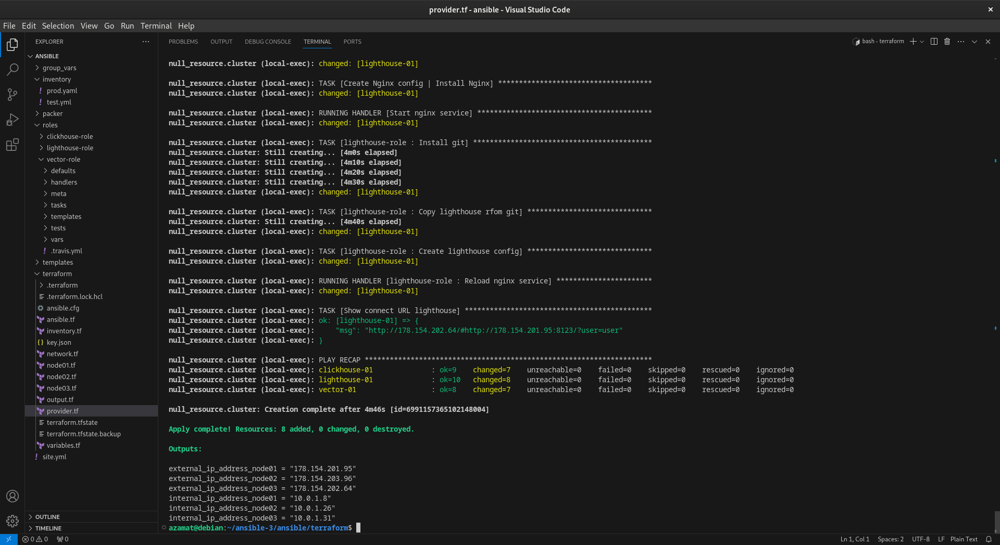
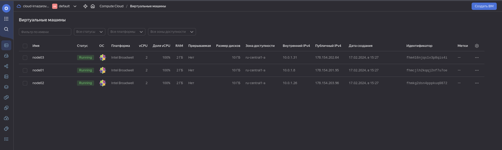
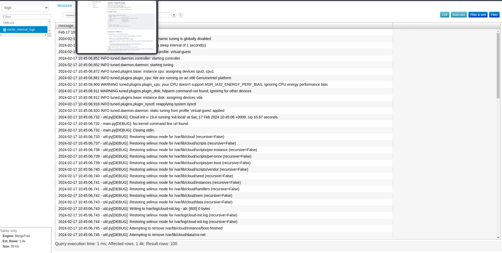

# ansible-3
## Подготовка к выполнению

1. (Необязательно) Познакомтесь с [lighthouse](https://youtu.be/ymlrNlaHzIY?t=929)
2. Подготовьте в Yandex Cloud три хоста: для `clickhouse`, для `vector` и для `lighthouse`.

Ссылка на репозиторий LightHouse: [https://github.com/VKCOM/lighthouse](https://github.com/VKCOM/lighthouse)

## Основная часть

1. Допишите playbook: нужно сделать ещё один play, который устанавливает и настраивает lighthouse.
```
  - name: lighthouse-role
    src: git@github.com:danilabar/lighthouse-role.git
    scm: git
    version: "0.1.0"
```
2. При создании tasks рекомендую использовать модули: `get_url`, `template`, `yum`, `apt`.
3. Tasks должны: скачать нужной версии дистрибутив, выполнить распаковку в выбранную директорию, сгенерировать конфигурацию с параметрами.
4. Приготовьте свой собственный inventory файл prod.yml.
5. Запустите `ansible-lint site.yml` и исправьте ошибки, если они есть.
6. Попробуйте запустить playbook на этом окружении с флагом `--check`.
2. Запустите playbook на `prod.yml` окружении с флагом `--diff`. Убедитесь, что изменения на системе произведены.
3. Повторно запустите playbook с флагом `--diff` и убедитесь, что playbook идемпотентен.
4. Подготовьте README.md-файл по своему playbook. В нём должно быть описано: что делает playbook, какие у него есть параметры и теги.
5. Готовый playbook выложите в свой репозиторий, поставьте тег `08-ansible-03-yandex` на фиксирующий коммит, в ответ предоставьте ссылку на него.
## Решение
* Виртуальные машины создаются через terraform, далее используется ansible на локальной машине
* Роли для `clickhouse`, `vector`, `lighthouse`  [здесь](./ansible/roles)
* [Inventory](./ansible/terraform/inventory.tf) формируется при инициализации инфраструктуры
* Добавлена установка `lighthouse` в [site.yml](./ansible/site.yml)
* Созданы [group_vars](./ansible/group_vars/light_house)
Необходимо добавить ключ `key.json` в директории `terraform`:
```
yc iam key create \
  --service-account-id <идентификатор_сервисного_аккаунта> \
  --folder-name <имя_каталога_с_сервисным_аккаунтом> \
  --output key.json
```
Далее используем `terraform apply`:


После исполнения `terraform` получается ссылка формата: `http://51.250.79.234/#http://178.154.207.179:8123/?user=user`
Пароль `password`

* После работы используйте:
```
terraform destroy
```